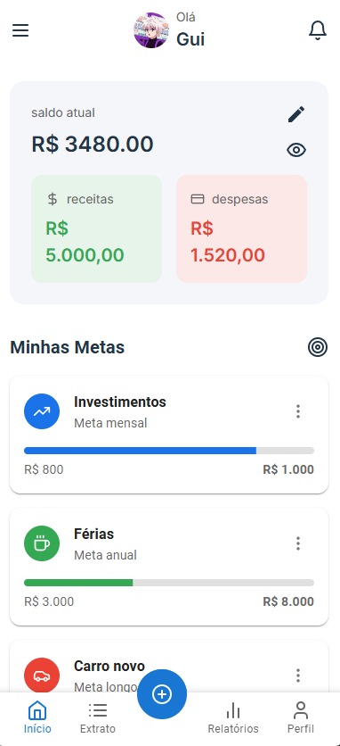

# **BagCoin** 📊💰

[](https://github.com/Guisandroni/bagcoin/blob/main/LICENSE)

**BagCoin** é uma aplicação financeira simples e intuitiva desenvolvida para ajudar você a gerenciar suas finanças pessoais de forma eficiente. Com recursos como controle de receitas, despesas e metas financeiras, esta ferramenta é perfeita para quem deseja organizar sua vida financeira sem complicações.




---

## **Recursos Principais** ✨

- **Controle de Receitas**: Registre suas fontes de renda e acompanhe suas entradas financeiras.
- **Gestão de Despesas**: Adicione e categorize suas despesas para ter uma visão clara de onde seu dinheiro está sendo gasto.
- **Metas Financeiras**: Defina metas personalizadas (como economizar para uma viagem ou quitar dívidas) e acompanhe seu progresso.
- **Interface Simples e Intuitiva**: Fácil de usar, mesmo para iniciantes em gestão financeira.
- **Relatórios e Insights**: Visualize gráficos e relatórios para entender melhor seus hábitos financeiros.

---

## **Tecnologias Utilizadas 💻**

O BagCoin foi desenvolvido utilizando as seguintes tecnologias:

- **[React](https://reactjs.org/)**: Uma biblioteca JavaScript amplamente utilizada para criar interfaces de usuário modernas e dinâmicas.
- **[Material-UI (MUI)](https://mui.com/)**: Um framework de componentes React que fornece uma coleção rica de elementos pré-estilizados, garantindo uma interface limpa e responsiva.

Essas tecnologias permitem que o BagCoin seja altamente interativo, responsivo e fácil de manter.

---

## **Instalação 🛠️**

Para executar o projeto localmente, siga os passos abaixo:

1. Clone o repositório:
   ```bash
   git clone https://github.com/Guisandroni/bagcoin.git
   ```

2. Navegue até o diretório do projeto:
   ```bash
   cd bagcoin
   ```

3. Instale as dependências necessárias:
   ```bash
   npm install
   ```

4. Inicie a aplicação:
   ```bash
   npm start
   ```

5. Acesse a aplicação no navegador:
   ```
   http://localhost:3000
   ```

> **Nota**: Certifique-se de ter o Node.js instalado em sua máquina antes de prosseguir.

---

## **Como Contribuir 🤝**

Contribuições são sempre bem-vindas! Se você deseja contribuir para o desenvolvimento do BagCoin, siga as etapas abaixo:

1. Faça um fork do repositório.
2. Crie uma branch para sua feature ou correção:
   ```bash
   git checkout -b feature/nome-da-feature
   ```
3. Faça suas alterações e commit:
   ```bash
   git commit -m "Adiciona descrição da mudança"
   ```
4. Envie suas alterações para o GitHub:
   ```bash
   git push origin feature/nome-da-feature
   ```
5. Abra um Pull Request explicando suas alterações.

---

## **Licença 📜**

Este projeto está licenciado sob a [MIT License](https://github.com/Guisandroni/bagcoin/blob/main/LICENSE). Sinta-se à vontade para usá-lo, modificá-lo e distribuí-lo conforme necessário.

